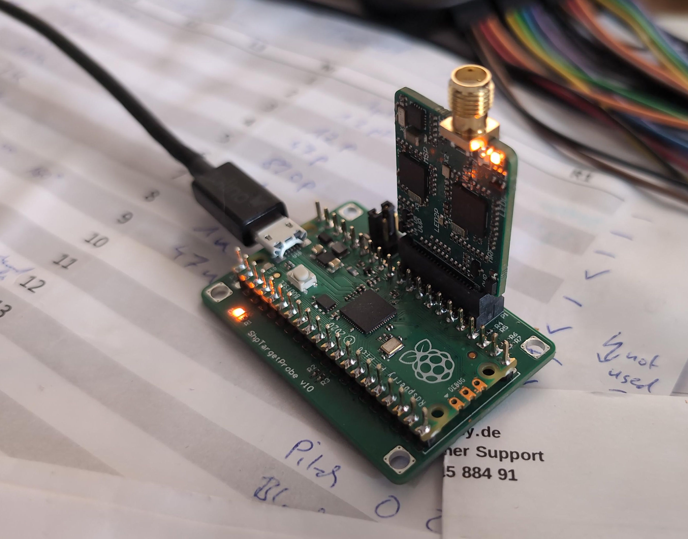
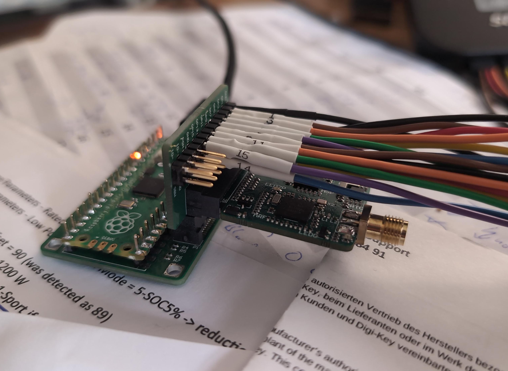
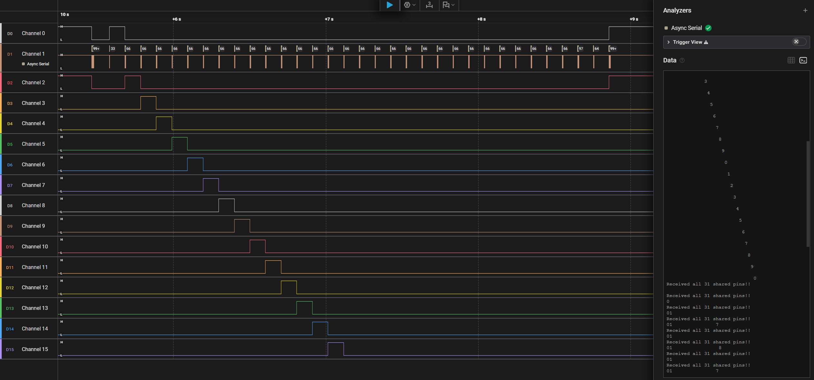

# Shepherd Target Programmer

This device allows powering Target-PCBs and programming both MCUs.
It is based on the [Riotee-probe](https://www.riotee.nessie-circuits.de/docs/latest/hardware/probe.html).

This directory contains: 

- schematics, 
- designfiles,
- BOM and 
- assembly drawings

## Supply Firmware

First the Firmware [probe_riotee_board_xyz.hex](https://github.com/NessieCircuits/Riotee_ProbeSoftware/releases) has to be flashed to the RP2040.
Simply hold the `Bootsel`-Button while connecting the board to your PC.
A flash-drive should appear were you can pull in the .hex-file.
The window closes and the firmware gets flashed.

## Install ProbeSoftware

To use the programmer, the Riotee platform provides a probe-software.
You can install it via your prefered python package-manager.
Here pip is used:

```Shell
pip install riotee-probe
```

For more up to date features you can also directly install from git:

```Shell
pip install git+https://github.com/NessieCircuits/Riotee_ProbeSoftware@main#subdirectory=tool
```

## Programming Targets

Some [demo-firmwares are available in the release-section](https://github.com/nes-lab/shepherd-targets/releases) of this repo.

The programmer can be used like that:

```Shell
riotee-probe program -d msp430 -f ./msp430_deep_sleep/build.hex
riotee-probe program -d nrf52 -f ./nrf52_deep_sleep/build.hex

riotee-probe program -d msp430 -f ./msp430_testable/build.hex
riotee-probe program -d nrf52 -f ./nrf52_testable/build.hex

riotee-probe program -d nrf52 -f ./nrf52_rf_test/build.hex
# sends 1 BLE packet per second, Shepherd-beacon, MAC 00:01:02:03:04:05
```

If the nRF52 fails to program with an error similar to

```
  File "C:\Users\hans\AppData\Local\Programs\Python\Python313\Lib\site-packages\pyocd\probe\cmsis_dap_probe.py", line 684, in write_ap_multiple
    raise self._convert_exception(exc) from exc
pyocd.core.exceptions.TransferFaultError: Memory transfer fault @ 0x20004000-0x200040c3
```

the underlying PyOCD can be used to perform a chip-erase:

```Shell
pyocd erase --mass -v -f 1000 -t nrf52840
pyocd erase --chip -v -f 1000 -t nrf52840
# + powercycle
# NOTE: one of the two commands should suffice
```

## Interfacing Targets

The target-connector only routes the programming lines and UART (Shepherd GPIO 0 & 1).
See [gpio-table here](https://github.com/nes-lab/shepherd-targets/tree/main/hardware/shepherd_nRF_FRAM_Target_v1.3e#nrf52--msp430-fram-target-v13e).

Note that the programmer does not cut power to the target like the Riotee probe does.
Some operations need a power-cycle - for that you could replug the USB-Connector.

To capture all GPIO a logic analyzer and [debug adapter](https://github.com/nes-lab/shepherd-targets/tree/main/hardware/adapter_target_v1.3_debug_big) need to be used.







## References

- [test-report of targets - first batch](https://github.com/orgua/shepherd-v2-planning/blob/main/doc_testbed/Target_v13_pre-deployment-tests.xlsx)
- [test-report of targets - 2025 batch](https://github.com/orgua/shepherd-v2-planning/blob/main/doc_testbed/Target_v13e_pre-deployment-tests.xlsx)
